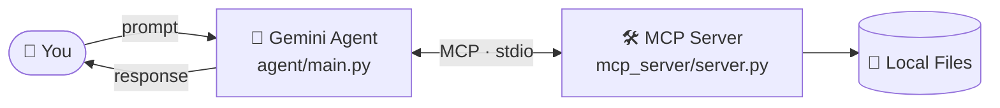

<div align="center">

# 🤖 AI Developer Assistant MCP

### An AI coding assistant powered by Gemini + Model Context Protocol

Give an LLM safe, structured access to your project files — list, read, and search — through a clean MCP tool server.

[](https://www.python.org/)
[](https://ai.google.dev/)
[](https://modelcontextprotocol.io/)
[](#license)

</div>

---

## ✨ Overview

**AI Developer Assistant MCP** connects a Gemini-powered chat agent to a local **MCP server** that exposes safe file-system tools. Ask the agent about your codebase in plain English — it lists directories, reads files, and searches content on your behalf.

The project has two moving parts:

| Component | File | Role |
|---|---|---|
| 🧠 **Agent** | `agent/main.py` | Interactive Gemini chat client |
| 🛠️ **MCP Server** | `mcp_server/server.py` | Provides file-management tools over stdio |

---

## 🚀 Features

- 📂 **List** files and folders in any directory
- 📄 **Read** the contents of a text file
- 🔍 **Search** for text across files in a directory

---

## 🧭 How It Works



1. The agent loads `GEMINI_API_KEY` from `.env`.
2. It launches `mcp_server/server.py` over an MCP stdio connection.
3. It discovers the server's tools and hands them to Gemini.
4. When Gemini calls a file tool, the agent forwards it to the MCP server and returns the result.

---

## 📁 Project Structure

```text
AI-Developer-Assistant-MCP/
├── agent/
│   └── main.py              # Interactive Gemini-powered agent
├── mcp_server/
│   └── server.py            # MCP server and file tools
├── test_project/
│   └── notes.txt            # Sample project files for testing
├── .env.example             # Environment variable template
├── .gitignore
├── README.md
└── requirements.txt         # Python dependencies
```

> `venv/` is a local dev environment — not part of the application source.

---

## ⚙️ Requirements

- Python **3.10+**
- A **Google Gemini API key**

---

## 🛠️ Setup

**1. Create and activate a virtual environment**

```powershell
python -m venv venv
.\venv\Scripts\Activate.ps1
```

**2. Install dependencies**

```powershell
pip install -r requirements.txt
```

**3. Create your `.env` file**

```powershell
Copy-Item .env.example .env
```

**4. Add your API key** to `.env`

```text
GEMINI_API_KEY=your_api_key_here
```

---

## ▶️ Run

From the project root:

```powershell
python agent/main.py
```

The agent starts the MCP server automatically, then opens an interactive prompt.
Type `exit` to close the session.

---

## 📝 Notes

- ⚠️ Run commands from the repository root so the agent can locate `mcp_server/server.py`.
- 🔒 Only point the file tools at directories and files you trust — they access your local filesystem.

---

<div align="center">

Made with 🧠 + ☕ · built on the [Model Context Protocol](https://modelcontextprotocol.io/)

</div>